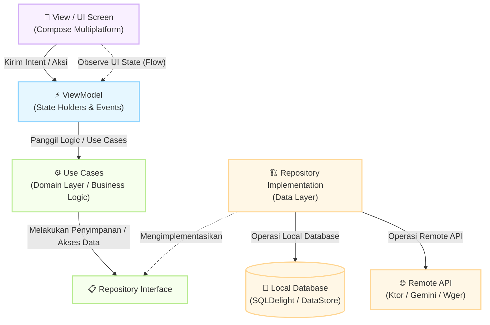

<div align="center">
  
</div>

<div align="center">

# 📱 FitGen


<br>

<br>

<br>


*Aplikasi pelacak kebugaran dan kesehatan komprehensif dengan asisten virtual cerdas.*

</div>
---

# Deskripsi Singkat & Latar Belakang

Fitgen adalah aplikasi pelacak kebugaran dan kesehatan komprehensif berbasis Kotlin Multiplatform (KMP). Di era modern, banyak orang kesulitan memantau aktivitas fisik dan pola makan sehat mereka secara konsisten karena kurangnya alat pencatatan yang cerdas dan terintegrasi.

Oleh karena itu, FitGen hadir untuk merevolusi cara pengguna memantau gaya hidup sehat mereka dengan menggabungkan berbagai fungsionalitas dalam satu platform. Mulai dari pencatatan olahraga harian, pelacak nutrisi otomatis dengan AI, hingga asisten virtual pribadi untuk memandu rutinitas kesehatan harian Anda. Semua ini disajikan dalam antarmuka yang modern, dinamis, dan terpadu untuk platform Android dan iOS menggunakan satu basis kode.

## Konteks Proyek

```text
📦 composeApp/src/commonMain
 ┣ **Catatan:** Proyek ini disusun secara khusus untuk memenuhi **Tugas Besar Mata Kuliah Pengembangan Aplikasi Mobile (PAM)**
```
--- 
## Fitur Utama
1. **AI Food Scanner (Pemindai Nutrisi)** - Pindai gambar makananmu, dan AI akan mengidentifikasi nama makanan, estimasi kalori, serta rincian makronutrien (Protein, Karbohidrat, Lemak) secara otomatis
2. **AI Workout Generator/Smart Assistant** - Chatbot cerdas yang siap menjawab pertanyaanmu mengenai rekomendasi latihan, penyesuaian jadwal latihan, diet, dan pemulihan tubuh
3. **Daily Tracker (Nutrisi & Hidrasi)** - Lacak jumlah asupan harianmu, asupan nutrisi, air, serta login streak untuk menjaga motivasi dengan grafik yang interaktif.
4. **Popular Challenges & Exercises** - Ikuti tantangan olahraga populer dan cari katalog latihan dengan panduan animasi/GIF (didukung oleh Wger API).
5. **Dark Mode** - Pengalaman pengguna yang nyaman bagi mata baik di kondisi terang maupun gelap.

## Screenshots
Berikut adalah cuplikan fitur-fitur dari aplikasi FitGen:
1. **Homepage & Dashboard**
   | **Homepage dan Dashboard Light Mode** | **Homepage dan Dashboard Dark Mode** |
   | :---: | :---: |
   |  |  | 
2. **Popular Challenges & Detail**
   | **Popular Challenges Light Mode** | **Detail Light Mode** | **Popular Challengers Dark Mode** | **Detail Dark Mode** |
   | :---: | :---: | :---: | :---: |
   |  |  |  |  |
3. **AI Workout & Assistant**
   | **AI Workout dan Assistant Light Mode** | **AI Workout dan Assistant Dark Mode** |
   | :---: | :---: |
   |  |  |
4. **Classic Workout & Timer + Tambah Custom Latihan**
   | **Classic Workout Light Mode** | **Timer Light Mode** | **Tambah Custom Latihan Light Mode** | **Classic Workout Dark Mode** | **Timer Dark Mode** | **Tambah Custom Latihan Dark Mode** | 
   | :---: | :---: | :---: | :---: | :---: | :---: |
   |  |  |  |  |  |  |
5. **Page Latihan & Rekap Latihan (Harian/Mingguan/Bulanan)**
   | **Page Latihan dan Rekap Latihan Light Mode** | **Page Latihan dan Rekap Latihan Dark Mode** |
   | :---: | :---: |
   |  |  |
6. **Custom Latihan & Search Bar Latihan**
   | **Custom Latihan Light Mode** | **Search Bar Latihan Light Mode** | **Custom Latihan Light Mode Dark Mode** | **Search Bar Latihan Dark Mode** |
   | :---: | :---: | :---: | :---: |
   |  |  |  |  |
7. **Page Nutrisi Harian & AI Cam Food Scanner**
   | **Page Nutrisi Harian Light Mode** | **AI Cam Food Scanner Light Mode** | **Page Nutrisi Harian Dark Mode** | **AI Cam Food Scanner Dark Mode** |
   | :---: | :---: | :---: | :---: |
   |  |  |  |  |
8. **Profil Page & Edit Profil**
   | **Profil Page Light Mode** | **Edit Profil Light Mode** | **Profil Page Dark Mode** | **Edit Profil Dark Mode** |
   | :---: | :---: | :---: | :---: |
   |  |  |  |  |

---

## Error Handling Terintegrasi
Aplikasi telah dilengkapi validasi data dan error handling untuk menjamin stabilitas:

* Validasi Profil Pengguna:
   * Maksimal berat badan (BB) adalah 500 kg.
   * Maksimal tinggal badan (TB) adalah 300 cm.
   * Maksimal umur adalah 120 tahun
   * Nilai di atas tidak boleh negatif/minus.
* Koneksi Internet (AI Page): Jika tidak ada koneksi internet saat menggunakan AI Workout atau Scanner, aplikasi akan menolak permintaan dan memunculkan notifikasi/pesan "Cek jaringan Anda".

---

## Seluruh Tech Stack
Aplikasi ini menggunakan teknologi lintas platform yang modern dan clean architecture (MVVM):

* UI Framework: Compose Multiplatform - UI deklaratif untuk Android & iOS.
* Networking: Ktor Client - HTTP Request untuk API Gemini dan Wger.
* Dependency Injection: Koin - Mengelola lifecycle, ViewModel, dan Repository.
* Local Database: SQLDelight - Database SQLite lokal yang type-safe.
* Local Preferences: DataStore & Okio - Menyimpan konfigurasi, state login, dan streak harian.
* Image/Media Processing: Coil3 (render gambar/GIF) & Peekaboo (fitur kamera/galeri native).
* Secrets Management: BuildKonfig - Menyimpan kunci API secara aman.
* Concurrency: Kotlin Coroutines & Flow.

---

## 🏗️ Diagram Arsitektur MVVM

FitGen mengimplementasikan pola arsitektur **MVVM (Model-View-ViewModel)** yang dipadukan dengan prinsip *Clean Architecture* untuk memastikan kode komponen tetap terpisah, modular, mudah diuji (*testable*), serta optimal saat dijalankan di lingkungan Kotlin Multiplatform.



---

## Persyaratan Sistem & Instalasi
Persyaratan Sistem:
* **Java**: JDK 17 atau lebih baru
* **IDE**: Android Studio Ladybug/Intellij IDEA
* **Untuk iOS**: macOS dengan versi terbaru Xcode terinstal

Instalasi & Cara Menjalankan
1. Clone repositori ini
   ```bash
   git clone <link-repositori>
   ```
2. Siapkan local.properties: Duplikat file local.properties.example menjadi local.properties dan isi dengan API Key yang valid (untuk Gemini AI API dll).
3. Sinkronisasi Gradle: Buka project di Android Studio, lalu lakukan sync project dengan Gradle files.
4. Jalankan Aplikasi:
   * Android: Pilih konfigurasi run composeApp untuk Android dan tekan Run (shift + F10).
   * iOS: Pilih konfigurasi run iosApp dan jalankan di simulator atau perangkat fisik Apple.
  
---

## Struktur Proyek
Berikut adalah gambaran tingkat tinggi dari struktur proyek Kotlin Multiplatform ini:

```text
📦 composeApp/src/commonMain
 ┣ 📂 core          # Utilitas umum, Config Ktor, Ekstensi, dll.
 ┣ 📂 data          # Repository Implementation, Data Sources (SQLDelight, Ktor).
 ┣ 📂 di            # Konfigurasi Dependency Injection dengan Koin.
 ┣ 📂 domain        # Interface Repository, Models (Entity), dan Use Cases.
 ┣ 📂 presentation  # Layer UI (Screens), ViewModels, dan Theme.
 ┗ 📂 sqldelight    # Skema Tabel Database (.sq) untuk Code Generation.
```
 ---

 ## Video YouTube
 Tonton demonstrasi lengkap fitur dan cara penggunaan aplikasi FitGen pada video di bawah ini:
 <div align="left">
  <a href="https://youtube.com/shorts/2iAqDp_CnL0">
    
  </a>
</div>

 ---

 ## Anggota Tim
 
 | **No** | **Nama** | **NIM** |
 | --- | --- | --- |
 | 1 | Anisah Octa Rohila | 123140137 |
 | 2 | Fanisa Aulia Safitri | 123140121 |


**Dosen Pengampu**: Muhammad Habib Alghifari, S.kom., M.Kom.
